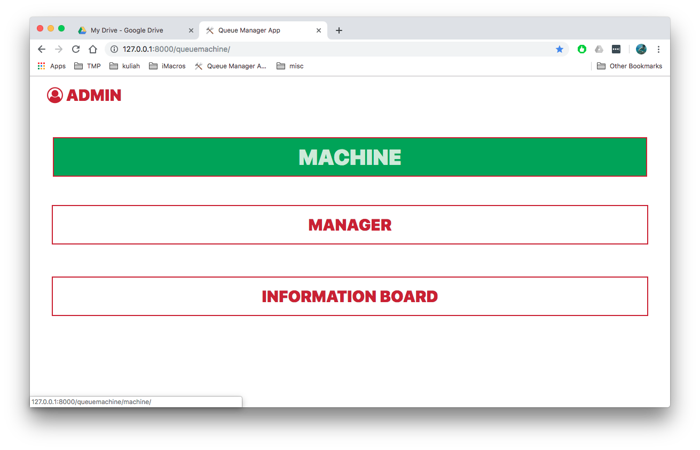

# queuemachine

Mesin antrian sederhana untuk sebuah klinik.

Sistem mesin antrian ini berbasis web agar dapat di gunakan di 3 cabang milik klinik tersebut. Aplikasi web di bangun menggunakan framework Django, sedangkan frontend aplikasi ini dibangun menggunakan framework jQuery dan Bootstrap.





installasi apllikasi bisa ikutin cara installasi applikasi django lainnya

## dev install
### langkah langkah di bawah ini digunakan untuk installasi applikasi di environment development

pastikan list dibawah ini sudah terinstall di komputer development
- Python 3
- virtual env
- pip

buat virtual environment python dan aktivasi virtual env tersebut
```bash
mkdir -p ~/.envs
cd ~/.envs
virtualenv queuemachine
source queuemachine/bin/activate
```

download/clone repo ini
```bash
cd ~ // masuk ke working directory anda
git clone https://github.com/dgallantino/queuemachine.git
```

masuk ke repo dan install kebutuhan repo yang ada 
```bash
cd queuemachine
pip install -r requirement.txt
```

jalankan server development django di foreground dengan command:
```bash
django-admin runserver
```

lakukan migrasi database
```bash
manage.py migrate
```

buat super django super user untuk memasuki halaman admin django app 
```bash
manage.py create superuser
```

buka web browser dan arahkan ke komputer development dengan port 8000
dan login menggunakan super user
```
http://localhost:8000
```


optional:
masukan data yang telah disediakan kedalam database untuk keperlua tes
```bash
manage.py loaddata queue/fixtures/counter.json queue/fixtures/organization.json queue/fixtures/service.json
```
