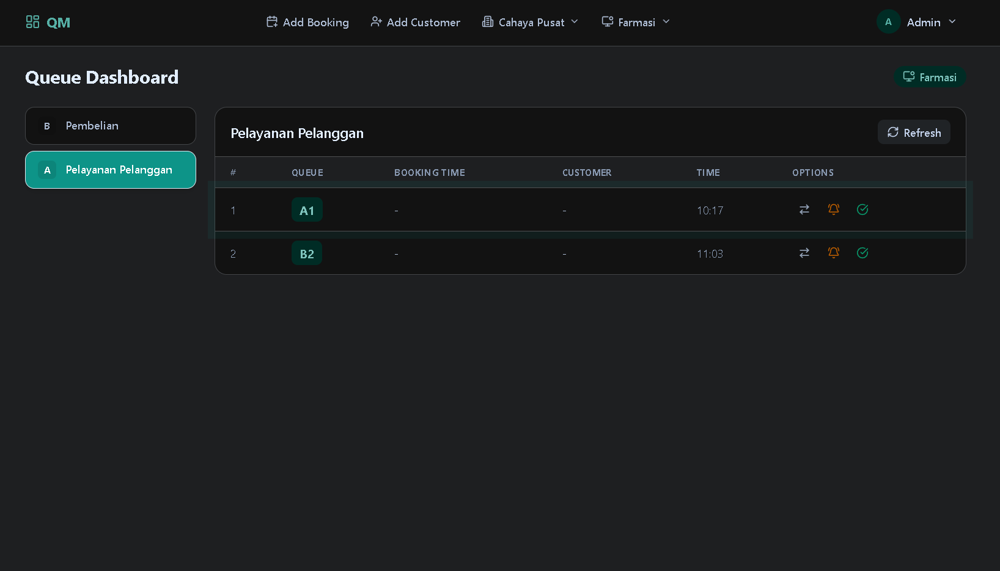
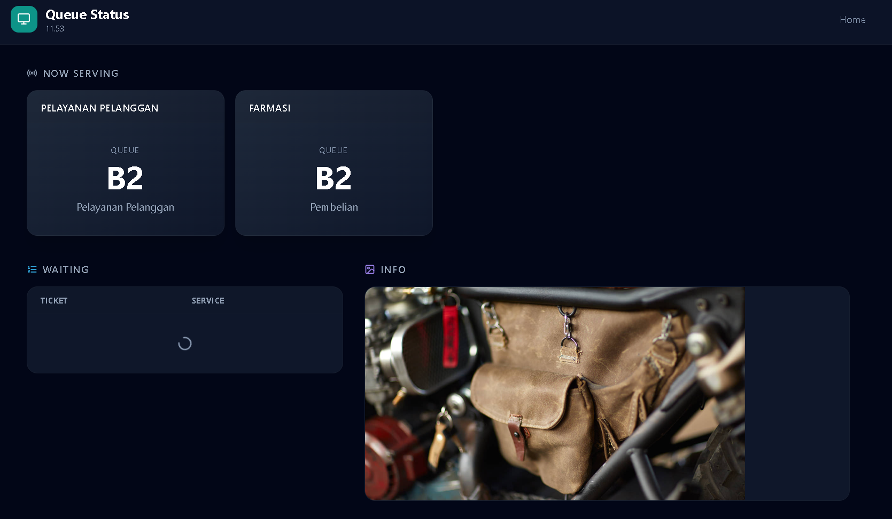

# Queue Machine

A web-based queue ticket system for clinics. It supports multiple branches from a single deployment and provides three main surfaces:

- **Ticket machine** — kiosk UI for issuing queue tickets
- **Manager** — staff dashboard for calling queues, bookings, and customers
- **Information board** — public display of current queue status

The backend is **Django**. The frontend uses **Django templates**, **Tailwind CSS**, **HTMX**, **Alpine.js**, **Lucide**, **Tom Select**, and **Flatpickr**. Third-party frontend assets are vendored at build time (not stored in git). See [Frontend assets](#frontend-assets) below.

## Screenshots





## Requirements

### Local development

- Python 3.8+
- MySQL 5.7+ or 8.x
- Node.js 18+ and npm
- bash and curl (Git Bash or WSL on Windows)
- **ffmpeg** — required for `queue_sounds generate` (converts gTTS MP3 output to WAV fragments)

  ```bash
  # Debian / Ubuntu
  sudo apt install ffmpeg

  # macOS (Homebrew)
  brew install ffmpeg
  ```

### Production (Docker)

- Docker and Docker Compose

The app image includes **ffmpeg** (installed in the Dockerfile) for sound fragment generation.

---

## Frontend assets

The queue app frontend uses **Tailwind CSS**, **HTMX**, **Alpine.js**, **Lucide**, **Tom Select**, and **Flatpickr**. These are **not committed** to the repository. They are downloaded and built during deployment (Docker build or local setup).

### Generated output

| Output | Purpose |
|--------|---------|
| `queue_app/static/queue_app/vendor/` | Third-party JS/CSS/fonts |
| `queue_app/static/queue_app/core/css/tailwind.css` | Compiled Tailwind stylesheet |
| `staticfiles/` (after `collectstatic`) | Full static tree for nginx |

All of the above paths are listed in `.gitignore`.

### Pinned versions

Defined in `scripts/vendor_frontend.sh` and `package.json`:

- HTMX 2.0.4
- Alpine.js 3.14.8
- Lucide 0.469.0
- Tom Select 2.4.1
- Flatpickr 4.6.13
- Tailwind CSS 3.4.x (+ `@tailwindcss/forms`, `@tailwindcss/typography`)

To upgrade a library, edit the URLs/versions in `scripts/vendor_frontend.sh` (and `package.json` for Tailwind plugins), then rebuild.

### Build commands

Full build (vendor download + Tailwind compile):

```bash
npm install
npm run build
```

This runs:

1. `scripts/vendor_frontend.sh` — downloads vendor assets
2. `tailwindcss` — compiles `tailwind.src.css` → `tailwind.css`

Re-run after changing templates or upgrading frontend dependencies.

Vendor only (no Tailwind rebuild):

```bash
bash scripts/vendor_frontend.sh
```

Tailwind only:

```bash
npx tailwindcss -i queue_app/static/queue_app/core/css/tailwind.src.css \
  -o queue_app/static/queue_app/core/css/tailwind.css --minify
```

### Template includes

Vendor assets are loaded via Django `` in:

- `queue_app/templates/queue_app/includes/vendor_head.html` — core stack
- `queue_app/templates/queue_app/includes/vendor_forms.html` — form CSS
- `queue_app/templates/queue_app/includes/vendor_forms_js.html` — form JS

Custom app code remains in the repo:

- `queue_app/static/queue_app/core/css/app.css`
- `queue_app/static/queue_app/core/js/app.js`
- `queue_app/static/queue_app/images/`

### Removed legacy assets

The following are no longer in the repository (Bootstrap, jQuery, Font Awesome, jQuery UI, collected `static/` tree, etc.). Django admin and django-autocomplete-light still load their own static files from installed Python packages via `collectstatic`.

---

## Local development

### 1. Clone the repository

```bash
git clone https://github.com/dgallantino/queuemachine.git
cd queuemachine
```

### 2. Create a virtual environment

```bash
python -m venv venv

# Linux / macOS
source venv/bin/activate

# Windows (PowerShell)
.\venv\Scripts\Activate.ps1
```

### 3. Configure environment variables

```bash
cp .env.example .env
```

Edit `.env` for local use. Example values:

```env
QUEUE_MACHINE_SECRET_KEY=dev-secret-key-change-me
QUEUE_MACHINE_DEBUG=True
QUEUE_MACHINE_ALLOWED_HOSTS=localhost,127.0.0.1

QUEUE_MACHINE_DB_NAME=queuemachine
QUEUE_MACHINE_DB_USER=queuemachine
QUEUE_MACHINE_DB_PASSWORD=changeme
QUEUE_MACHINE_DB_HOST=127.0.0.1
QUEUE_MACHINE_DB_PORT=3306
```

Create the MySQL database and user before running migrations.

### 4. Install Python dependencies

```bash
pip install -r requirement.txt
```

### 5. Build frontend assets

```bash
npm install
npm run build
```

See [Frontend assets](#frontend-assets) for details on generated files, pinned versions, and partial rebuild commands.

### 6. Run database migrations

```bash
python manage.py migrate
```

### 7. Create a superuser

```bash
python manage.py createsuperuser
```

### 8. Collect static files

```bash
python manage.py collectstatic --noinput
```

With `QUEUE_MACHINE_DEBUG=True`, Django serves static files during development. In production, nginx serves `/static/` directly.

### 9. Start the development server

```bash
python manage.py runserver
```

Open [http://localhost:8000/queuemachine/](http://localhost:8000/queuemachine/) in your browser.

### Optional: load sample data

```bash
python manage.py loaddata queue_app/fixtures/organization.json queue_app/fixtures/counter.json queue_app/fixtures/service.json
```

---

## Production deployment (Docker)

Production uses **three services**: MySQL, the Django app (Gunicorn), and nginx.

```
Browser
   │
   ▼
nginx :80  ── /static/* ──►  volume: staticfiles  (collectstatic output)
   │
   └── /* ── proxy ──►  app :8000 (Gunicorn → Django)
                              │
                              └── db :3306 (MySQL)
```

- **nginx** mounts the `staticfiles` volume at `/var/www/static/`, serves `/static/` directly from disk, and proxies all other requests to Gunicorn (`app:8000`).
- **app** runs Gunicorn. On startup, `deploy/entrypoint.sh` waits for MySQL, runs migrations, runs `collectstatic` into `/app/staticfiles` (shared volume), then starts Gunicorn.
- Frontend assets are vendored and built automatically during the Docker image build in the `assets` stage:

```dockerfile
RUN npm install && npm run build
```

### 1. Configure environment

```bash
cp .env.example .env
```

Set production values in `.env`:

| Variable | Description |
|----------|-------------|
| `QUEUE_MACHINE_SECRET_KEY` | Long random string (required) |
| `QUEUE_MACHINE_DEBUG` | `False` for production |
| `QUEUE_MACHINE_ALLOWED_HOSTS` | Comma-separated hostnames/IPs |
| `QUEUE_MACHINE_DB_*` | Database credentials |
| `QUEUE_MACHINE_DB_ROOT_PASSWORD` | MySQL root password (Compose only) |
| `QUEUE_MACHINE_HTTP_PORT` | Host port mapped to nginx (default `8080`) |

For Docker Compose, leave `QUEUE_MACHINE_DB_HOST=db`.

### 2. Build and start

```bash
docker compose up --build -d
```

### 3. Create an admin user

```bash
docker compose exec app python manage.py createsuperuser
```

### 4. Open the application

Visit [http://localhost:8080/queuemachine/](http://localhost:8080/queuemachine/) (or the port set in `QUEUE_MACHINE_HTTP_PORT`).

### Useful commands

```bash
# View logs
docker compose logs -f

# Stop services
docker compose down

# Stop and remove database volume
docker compose down -v
```

---

## Application URLs

| Page | Path |
|------|------|
| Home | `/queuemachine/` |
| Ticket machine | `/queuemachine/machine/` |
| Manager | `/queuemachine/manager/` |
| Information board | `/queuemachine/infoboard/` |
| Django admin | `/admin/` |
| Login | `/queuemachine/login/` |
